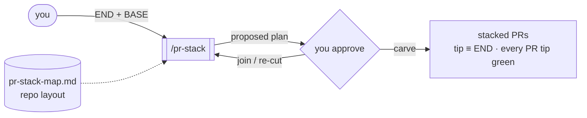

# pr-stack

An agent skill that splits one chunky "it all works" branch into a stacked
set of review-friendly PRs. The big model does the carving; humans and
review bots get PRs they can read.



## Install

```bash
npx skills add frontier159/pr-stack
```

Works in any agent that supports the [Agent Skills](https://agentskills.io)
format: Claude Code, Codex, Cursor, and others. Or copy `skills/pr-stack/`
into your agent's skills directory by hand.

## Usage

```
split <END> onto <BASE>     re-carve the branch into a stacked PR set
pr-stack map                generate/regenerate pr-stack-map.md
create a PR                 (chunky diff? the agent offers the split first)
```

One-shot: it runs when you ask, for that request alone.

## How to use

1. Finish your feature branch and get it green. That branch is `END`; the
   branch you target is `BASE`.
2. Say `split <branch> onto <base>`. The agent opens a fresh worktree,
   never touching your branch, and buckets every changed file using
   `pr-stack-map.md`. No map yet? It generates one, confirming UI-package
   layers with you once.
3. Review the proposed plan: numbered PRs × numbered commits, each with a
   one-line rationale. Mark joins ("join PR2+PR3", like squashing picks
   in an interactive rebase) or ask for a re-cut. The agent carves
   nothing until you approve.
4. The agent carves the commits, verifies each PR tip green, proves the
   final tip byte-identical to `END`, and pushes the stack bottom-up with
   bases chained and stack positions in each PR description.
5. Merge bottom-up. Review fixes and post-merge rebasing are normal git.
   The skill hands off a stack with correct bases and documentation.

## Example

A plan awaiting approval:

```markdown
PR 1 — api: typed flash errors                 (backend, 2 commits)
  1.1 refactor: extract error module            [technical-only]
  1.2 feat: FlashLiquidityError + tests
PR 2 — app/api: quote pipeline adopts errors   (backend, 3 commits)
  2.1 feat: translate flash errors + tests
  2.2 feat: retry classifier narrows types + tests
  2.3 chore: remove dead string-match
PR 3 — app/ui: error states                    (ui, 2 commits)
  3.1 feat: quote error components
  3.2 feat: swap page wiring
```

> operator: join PR2+PR3? The agent flags a forced-join only if PR2 can't
> go green alone. Otherwise they stay separate: backend and UI don't
> share a PR.

## How it works

**Isolate.** Opens a fresh `git worktree` at `BASE` and records `END`'s
SHA. Your branch stays put as the known-good state.

**Map.** Loads `pr-stack-map.md`: PR ordering from a topological sort of
your workspace packages, backend/ui classification from conventional
directories with an extension tiebreaker. A manifest hash in the header
catches staleness; edits under `MANUAL OVERRIDES` survive regeneration.
Repo specifics live in the map file, which keeps the skill language- and
package-manager-independent.

**Plan.** Buckets the cumulative `BASE..END` diff by tier and proposes
the full PR × commit decomposition. Waits for your sign-off.

**Carve.** Re-carves the diff into fresh commits, ascending map tier:
technical-only commits first, tests riding with the code they cover.
Green per commit is the soft default; a green PR tip is the hard rule.

**Verify & hand off.** `git diff <tip> END` must print nothing. Pushes
bottom-up, chains PR bases, documents stack order.

## What makes the stack reviewable

- **One concern per commit.** Renames and refactors get their own
  commits; upstream-package changes carry only their minimal dependents.
- **Dependencies-first ordering.** Reviewers read api and tests before
  the components that consume them, components before pages.
- **Provable fidelity.** The stack ends byte-identical to the branch you
  validated, so reviewers judge legibility instead of re-verifying
  behaviour.

## Hard rules

- Never touches the original branch or worktree; all surgery happens in
  a disposable worktree.
- Never carves before you approve the plan.
- Never reorders existing commits; it re-carves the diff fresh, so
  interleaved concerns separate.
- Never runs unbidden: explicit request only, at most a one-line offer
  when you ask for a PR with a chunky diff.

<p align="center">
  
</p>

## License

MIT
